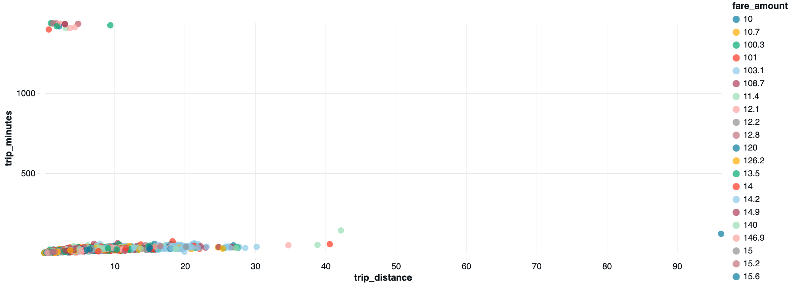
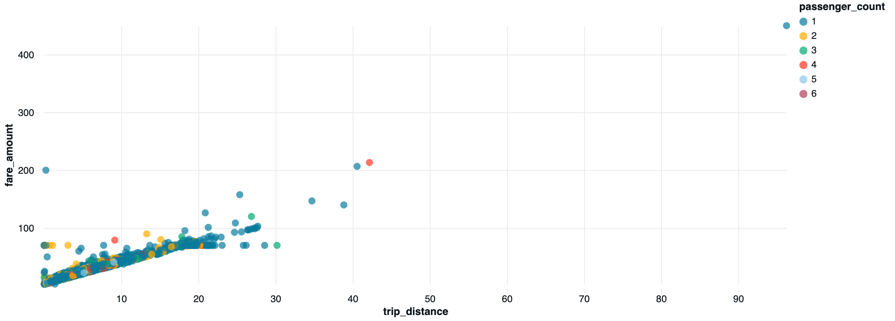

# ifood_case

Esse repositório contém as informações referentes ao processamento de dados de taxis em Nova Yorque. O objetivo é disponibilizar os dados processados para a camada de consumo e reponder às seguintes perguntas:

- Qual a média de valor total (`total_amount`) recebido em um mês considerando todos os yellow táxis da frota?
- Qual a média de passageiros (`passenger_count`) por cada hora do dia que pegaram táxi no mês de maio considerando todos os táxis da frota?

Os dados disponibilizados na camada de consumo devem conter as colunas: `VendorID` `passenger_count`, `total_amount`, `tpep_pickup_datetime` e `tpep_dropoff_datetime`.

## Processamentos de dados

A filosofia escolhida para processar os dados é a Medallion Architecture, que utiliza camadas Bronze, Silver e Gold, de forma que a qualidade e estruturação dos dados é incrementalmente melhorada de uma camada para a outra. 

### Bronze Layer

Nessa camada, os dados são extraídos da landing zone e salvos em uma tabela dentro do catálogo. A execução é feita através do notebook `src/raw_to_bronze.ipynb`. Nessa etapa, são incorporadas as estruturas mínimas de banco de dados ao se criar uma delta table, mas os dados são os mesmos já existentes no arquivo parquet.

Para possibilitar a ingestão dos dados em um banco estruturado, é necessário garantir que os dados ingeridos sejam compatíveis com o schema da tabela alvo. Por conta disso, essa camada se certifica que as colunas tenham os tipos esperados e converte os valores, caso necessário.

**premissas e considerações relevantes:**
 1. Considerando a possibilidade de um mesmo arquivo ser inserido mais de uma vez, e considerando que esses arquivos - de acordo com o que é descrito na fonte - são raramente modificados depois de disponibilizados, foi decidido evitar ingestões duplas verificando-se o nome do arquivo (na verdade, verificam-se os paramêtros passados para o notebook, que por sua vez são derivados do nome do arquivo)

2. Existe um padrão de nome de arquivo na fonte. O nome dos arquivos colocados na landing zone devem estar dentro desse padrão.

3. Foram adicionadas duas colunas, `source_prefix` e `source_month` para manter um registro da origem de cada linha na tabela, relacionando a linha ao arquivo de onde ela foi extraída.

### Silver Layer

Nessa camada, os dados são lidos diretamente da tabela Bronze e sanitizados para remover dados inconsistentes ou defeituosos. Os filtros de inconsistência aplicados foram:

- As datas de embarque e desembarque devem ser diferentes de `null`.
- A data de desembarque deve vir depois da data de embarque.
- A duração da viagem deve ser maior do que zero 0 e menor do que 12h.
- O valor da corrida deve ser maior do que 0.
- A distância da corrida deve ser maior do que 0.
- O total de passageiros deve ser maior do que 0.

Além disso, a data de embarque deve pertencer ao mês referente ao arquivo ingerido. Se a data de embarque estiver fora dessa janela, a linha é removida.

Por fim, foram adicionadas as colunas `pickup_date`, `pickup_hour` e `trip_minutes`, que trazem valores úteis para reponder a perguntas na próxima cama.

**Análise da consistência dos dados**

    Foi observado que o número de passageiros chega até 9. O valor máximo que eu esperava era 4 ou 5, mas existem carros que podem levar mais que 4 passageiros, com mais uma fileira de banco atrás. De acordo com a documentação na fonte dos dados, esse valor é inserido pelo motorista, então existe um fator de erro humano na inserção do dado, mas existe também uma indefinição de como isso seria calculado. Eu entendo que 4 adultos com duas crianças de colo podem ser registrados como 4 ou como 6. Considerando um carro com uma terceira fileira de banco (não raros nos Estados Unidos), 9 pessoas passa a ser possível. Como o número de registros que ficam nessa faixa é pequeno, eu espero que a influência desses dados na reposta da pergunta que envolve o número total de passageiros seja pequena. Por conta disso, decidi não filtrar por número máximo de passageiros.

    Buscando verificar se havia algum padrão de inconsistência, eu investiguei o preço da corrida como função da sua duração e da distância percorrida, bem como a relação direta entre duração e distância de uma corrida. Um scatter plot relacionando duração e distância mostrou que existe um conjunto de corridas com mais de 20 horas de duração e uma curtíssima distância percorrida - Ver Figura 1. Eu não consegui imaginar nada que justificasse isso, e optei por elimiar esses dados, usando o filtro que declarei acima, onde a corrida não pode ter mais do que 12 horas.

    
    Figura 1
    
    Observando o preço como função da distância e duração da corrida, eu pude observar que a relação entre preço e distância pode ser aproximada com boa confiança por uma reta com relação positiva entre preço e distância, como esperado - Ver Figura 2. Contudo, exite um outro padrão perceptível, onde uma reta horizontal se desenha precisamente no valor de 70 dólares, independente da distância. Após verificar, isso de deve à existência de uma taxa fixa nas corridas para o Aeroporto JFK (Manhattan flat fare). Além disso, alguns dados inesperados aparecem, como corridas muito caras para distâncias curtíssimas. A quantidade desses dados é baixa e eu não consegui estabelecer um critério claro que separasse o que seria um dado esperado de um inesperado, por isso optei por manter os dados nesse caso. 

    
    Figura 2

### Gold Layer

A Gold Layer é simplesmente uma view que extrai as colunas de consumo da camada silver selecionando as colunas relevantes.

## Configuração e provisionamento

### Databricks

A estrutura de tabelas deve ser rodada uma vez usando o notebook `data_structure`. É necessário configurar um job no databricks para executar os notebooks raw_to_bronze e bronze_to_silver em sequência. Esse job deve receber os parâmetros `dataset_prefix` e `month` e passá-los aos dois notebooks. O arquivo `databricks_job.yaml` pode ser usado como referência, com atenção para os valores específicos à conta.

Ao terminar de executar o job, um webhook é chamado. Isso é opcional e dever ser usado caso haja algum evento a ser executado após a disponibização dos dados na camada de consumo. Para usar essa funcionalidade, é necessário criar esse webhook e referenciar o seu id na definição do job.

### Provisionamento da landing zone na AWS e extração de dados.

A landing zone é um bucket s3. Quando um arquivo é adicionado nesse bucket, uma lambda function é chamada, que por sua vez chama um job de Databricks para fazer a ingestão do arquivo inserido. Para provisionar essa infraestutura, basta criar um CloudFormation stack a partir do template `src/databricks_trigger.yaml`.

## Camada de consumo

A camada de consumo pode ser acessada internamente no Databricks através da View

`workspace.ifood_gold.consumption`

