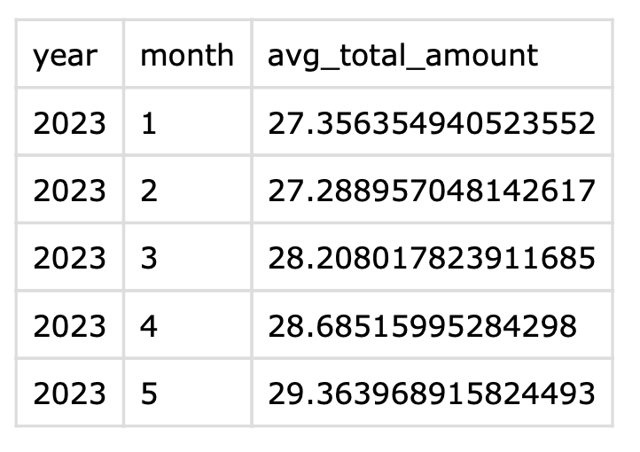
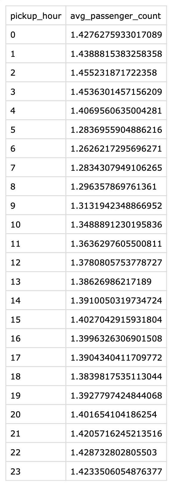

1. Qual a média de valor total (total_amount) recebido em um mês, considerando todos os yellow táxis da frota?

```sql
SELECT
  year(tpep_pickup_datetime) AS year,
  month(tpep_pickup_datetime) AS month,
  AVG(total_amount) AS avg_total_amount
FROM workspace.ifood_gold.consumption
GROUP BY year, month
ORDER BY year, month;
```


2. Qual a média de passageiros (passenger_count) por cada hora do dia que pegaram táxi no mês de maio, considerando todos os táxis da frota?

```sql
SELECT
  pickup_hour,
  AVG(passenger_count) AS avg_passenger_count
FROM workspace.ifood_gold.consumption
WHERE year(tpep_pickup_datetime) = 2023 and month(tpep_pickup_datetime) = 5
GROUP BY pickup_hour
ORDER BY pickup_hour;
```

